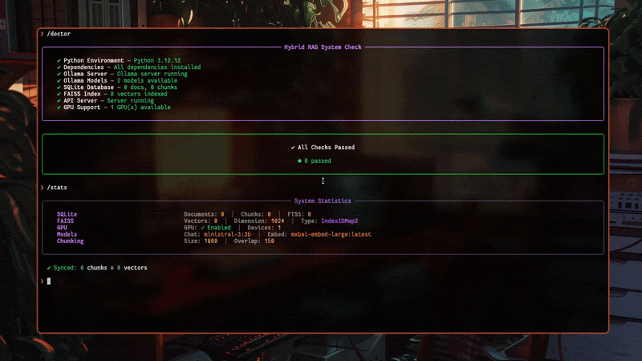

<div align="center">


**Hybrid Retrieval Augmented Generation with BM25 + FAISS Fusion and Citation Enforcement**

<a href="https://www.python.org/"></a>
<a href="https://fastapi.tiangolo.com/"></a>
<a href="https://ollama.ai/"></a>
<a href="https://www.langchain.com/"></a>
<a href="https://github.com/facebookresearch/faiss"></a>
<a href="https://www.sqlite.org/"></a>
<a href="https://docs.pydantic.dev/"></a>
<a href="https://rich.readthedocs.io/"></a>
<a href="https://www.docker.com/"></a>


*Hybrid RAG is a local knowledge base system I built to explore how modern retrieval pipelines work under the hood. It combines BM25 keyword search with FAISS vector similarity, fuses them using Reciprocal Rank Fusion, and generates answers through a local LLM with strict citation enforcement. Everything runs on your machine, no API keys required, no data leaving your system.*

</div>

---

## Table of Contents

1. [Overview](#1-overview)
   - 1.1 [About This Project](#11-about-this-project)
   - 1.2 [Why Hybrid Retrieval](#12-why-hybrid-retrieval)
   - 1.3 [Why Local LLM](#13-why-local-llm)
2. [Core Features](#2-core-features)
   - 2.1 [Hybrid Retrieval Pipeline](#21-hybrid-retrieval-pipeline)
   - 2.2 [Persistent Storage](#22-persistent-storage)
   - 2.3 [Citation Enforcement](#23-citation-enforcement)
   - 2.4 [GPU Acceleration](#24-gpu-acceleration)
   - 2.5 [Modern CLI](#25-modern-cli)
   - 2.6 [System Health Checks](#26-system-health-checks)
3. [Prerequisites](#3-prerequisites)
   - 3.1 [Required Software](#31-required-software)
   - 3.2 [Optional Components](#32-optional-components)
4. [Installation](#4-installation)
   - 4.1 [Using uv (Recommended)](#41-using-uv-recommended)
   - 4.2 [Using pip](#42-using-pip)
   - 4.3 [Using Docker](#43-using-docker)
   - 4.4 [Pull Required Ollama Models](#44-pull-required-ollama-models)
5. [Quick Start](#5-quick-start)
   - 5.1 [Launch the CLI](#51-launch-the-cli)
   - 5.2 [Start the Server](#52-start-the-server)
   - 5.3 [Ingest Documents](#53-ingest-documents)
   - 5.4 [Query the Knowledge Base](#54-query-the-knowledge-base)
6. [CLI Commands Reference](#6-cli-commands-reference)
   - 6.1 [Server Management](#61-server-management)
   - 6.2 [Knowledge Base Operations](#62-knowledge-base-operations)
   - 6.3 [System Management](#63-system-management)
   - 6.4 [General Commands](#64-general-commands)
   - 6.5 [Command Examples](#65-command-examples)
   - 6.6 [Important Workflow Notes](#66-important-workflow-notes)
   - 6.7 [Switching Models at Runtime](#67-switching-models-at-runtime)
7. [Configuration](#7-configuration)
   - 7.1 [Environment Variables](#71-environment-variables)
   - 7.2 [CPU Only Setup](#72-cpu-only-setup)
   - 7.3 [GPU Memory Management](#73-gpu-memory-management)
8. [API Reference](#8-api-reference)
   - 8.1 [Available Endpoints](#81-available-endpoints)
   - 8.2 [Interactive Documentation](#82-interactive-documentation)
9. [Project Structure](#9-project-structure)
   - 9.1 [Directory Layout](#91-directory-layout)
   - 9.2 [Core Components](#92-core-components)
10. [How It Works](#10-how-it-works)
    - 10.1 [Ingestion Pipeline](#101-ingestion-pipeline)
    - 10.2 [Retrieval Pipeline](#102-retrieval-pipeline)
11. [Known Limitations](#11-known-limitations)
    - 11.1 [Concurrent Ingestion](#111-concurrent-ingestion)
    - 11.2 [Large Files](#112-large-files)
    - 11.3 [PDF Extraction](#113-pdf-extraction)
    - 11.4 [Embedding Model Changes](#114-embedding-model-changes)
12. [Troubleshooting](#12-troubleshooting)
    - 12.1 [Connection Failed](#121-connection-failed)
    - 12.2 [Ollama Not Reachable](#122-ollama-not-reachable)
    - 12.3 [FAISS GPU Not Available](#123-faiss-gpu-not-available)
    - 12.4 [Database Index Out of Sync](#124-database-index-out-of-sync)
    - 12.5 [Schema Not Initialized](#125-schema-not-initialized)
    - 12.6 [Zero Vectors Indexed](#126-zero-vectors-indexed)
    - 12.7 [Dimension Mismatch Error](#127-dimension-mismatch-error)
13. [Documentation](#13-documentation)

---

## 1. Overview

### 1.1 About This Project

This is a mini hybrid RAG (Retrieval Augmented Generation) project I built to explore and understand how modern retrieval systems work under the hood. The goal was simple: create a local knowledge base that can ingest documents, retrieve relevant chunks using both sparse and dense retrieval methods, and generate answers with proper citations, all running locally without relying on external APIs.

I created this because I wanted to understand the nuances of hybrid retrieval. Most tutorials either show you BM25 or vector search separately, but combining them effectively with Reciprocal Rank Fusion (RRF) is where things get interesting. This project is my playground for that.

### 1.2 Why Hybrid Retrieval

Pure vector search is great for semantic similarity, but it can miss exact keyword matches. Pure BM25 is excellent for keyword matching, but it doesn't understand context. By combining both approaches, we get the best of both worlds:

**BM25 (Sparse)**: SQLite FTS5 full text search. Fast, deterministic, and excellent for exact term matching.

**FAISS (Dense)**: Vector similarity search with optional GPU acceleration. Captures semantic meaning.

**RRF Fusion**: Merges both ranked lists into a single, more accurate result set.

### 1.3 Why Local LLM

I use Ollama to run everything locally. No API keys, no rate limits, no data leaving your machine. This is particularly important when working with sensitive documents or when you simply want to experiment without worrying about costs.

---

## 2. Core Features

### 2.1 Hybrid Retrieval Pipeline

BM25 over SQLite FTS5 combined with FAISS vector similarity, fused using Reciprocal Rank Fusion. This approach ensures that both exact keyword matches and semantic similarities are captured in the retrieval process.

### 2.2 Persistent Storage

SQLite for document and chunk metadata, FAISS index persisted to disk. All your ingested documents and their embeddings survive application restarts.

### 2.3 Citation Enforcement

The system prompt requires the LLM to cite sources per paragraph using chunk IDs. This ensures that every claim in the generated response can be traced back to its source document.

### 2.4 GPU Acceleration

Optional FAISS GPU support via `faiss-gpu-cu12` for faster vector operations. When dealing with large knowledge bases, GPU acceleration significantly reduces search latency.

### 2.5 Modern CLI

Interactive terminal interface with tab completion, command history, and live server output. The CLI is built with Rich for beautiful formatting and a pleasant user experience.

### 2.6 System Health Checks

Built in `/doctor` command to verify all components are working correctly. This diagnostic tool checks database connectivity, FAISS index status, Ollama availability, and more.

---

## 3. Prerequisites

### 3.1 Required Software

Before you begin, make sure you have the following installed:

**Python 3.12 or higher**: Required, the project uses modern Python features.

**Ollama**: Running locally for LLM inference and embeddings.

### 3.2 Optional Components

**CUDA 12 + compatible GPU**: For FAISS GPU acceleration.

> [!NOTE]
> If you don't have a GPU, you can use `faiss-cpu` instead of `faiss-gpu-cu12`. See the [Configuration](#7-configuration) section below for detailed instructions on setting up CPU only mode.

---

## 4. Installation

### 4.1 Using uv (Recommended)

[uv](https://github.com/astral-sh/uv) is a fast Python package manager. If you don't have it, install it first.

```bash
# Clone the repository
git clone https://github.com/yourusername/hybrid-rag-kb.git
cd hybrid-rag-kb

# Install dependencies and create virtual environment
uv sync
```

### 4.2 Using pip

```bash
# Clone the repository
git clone https://github.com/yourusername/hybrid-rag-kb.git
cd hybrid-rag-kb

# Create virtual environment
python -m venv .venv
source .venv/bin/activate  # On Windows: .venv\Scripts\activate

# Install in editable mode
pip install -e .
```

### 4.3 Using Docker

Docker provides the easiest way to run the API server without installing Python dependencies locally. You still need Ollama running on your host machine.

```bash
# Clone the repository
git clone https://github.com/FamilOrujov/hybrid-rag-kb.git
cd hybrid-rag-kb

# Start the API server
docker compose up -d

# Check logs
docker compose logs -f

# Stop the server
docker compose down
```

The Docker container connects to Ollama running on your host machine. Make sure Ollama is running before starting the container:

```bash
ollama serve
```

You can customize the Ollama connection and models using environment variables:

```bash
# For Linux, if host.docker.internal doesn't work
OLLAMA_BASE_URL=http://172.17.0.1:11434 docker compose up -d

# Use different models
OLLAMA_CHAT_MODEL=llama3.2:3b OLLAMA_EMBED_MODEL=nomic-embed-text docker compose up -d
```

Data is persisted in the `./data` directory, so your knowledge base survives container restarts.

### 4.4 Pull Required Ollama Models

The project uses two models by default. Pull them before running:

```bash
ollama pull gemma3:1b          # Chat model (small, fast)
ollama pull mxbai-embed-large  # Embedding model (1024 dimensions)
```

> [!WARNING]
> Make sure Ollama is running before starting the application. Run `ollama serve` in a separate terminal if it's not already running as a service.

---

## 5. Quick Start

### 5.1 Launch the CLI

```bash
# Using uv
uv run python -m cli

# Or using the entry point (after pip install -e .)
hrag

# Or run the script directly
./hrag
```

### 5.2 Start the Server

Once in the CLI, start the FastAPI server:

```
/start
```

The server runs in the background, so you can continue using the CLI. Server logs are written to `data/server.log`.

### 5.3 Ingest Documents

Upload documents to build your knowledge base. You can pass file paths directly, use relative paths from your current directory, or point to an entire folder for batch ingestion.

<div align="center">



</div>

To ingest a single file, provide the path relative to your current working directory or use an absolute path:

```
/ingest ./my_document.pdf
/ingest /home/user/documents/research_paper.pdf
```

To ingest all supported files in a directory:

```
/ingest ./documents/
/ingest /path/to/folder/
```

You can also use glob patterns to match specific files:

```
/ingest ./papers/*.pdf
```

Supported formats: PDF, TXT, MD, JSON, CSV

### 5.4 Query the Knowledge Base

Ask questions and get answers with citations:

```
/query What are the main arguments about consciousness?
```

Or start an interactive chat session:

```
/chat
```

---

## 6. CLI Commands Reference

The CLI provides a modern, interactive terminal experience with tab completion, command history, and beautiful output formatting.

### 6.1 Server Management

| Command | Aliases | Description |
|---------|---------|-------------|
| `/start` | `/serve`, `/run` | Start the FastAPI server in background |
| `/stop` | | Stop the running server |
| `/restart` | `/reboot` | Restart the server (stops and starts in one command) |

The server runs in background mode by default, allowing you to continue using the CLI while it's running. Server logs are written to `data/server.log`.

### 6.2 Knowledge Base Operations

| Command | Aliases | Description |
|---------|---------|-------------|
| `/ingest` | `/upload`, `/add` | Upload documents to the knowledge base |
| `/query` | `/ask`, `/q` | Ask a question and get an answer with citations |
| `/chat` | `/interactive` | Start an interactive chat session with memory |
| `/chunk` | `/chunks`, `/c` | View a specific chunk by its ID |

### 6.3 System Management

| Command | Aliases | Description |
|---------|---------|-------------|
| `/stats` | `/status`, `/info` | Show system statistics (documents, chunks, vectors, GPU) |
| `/doctor` | `/health`, `/check` | Run comprehensive system health checks |
| `/reset` | `/clean`, `/wipe` | Remove database and index files (start fresh) |
| `/model` | `/models`, `/llm` | List and switch Ollama models for chat and embeddings |
| `/debug` | `/dbg` | Debug retrieval pipeline (BM25, vector, fused results) |

### 6.4 General Commands

| Command | Aliases | Description |
|---------|---------|-------------|
| `/help` | `/h`, `/?` | Show help information |
| `/clear` | `/cls` | Clear the terminal screen |
| `/quit` | `/exit` | Exit the CLI |

### 6.5 Command Examples

```bash
# Start server and check status
/start
/stats

# Ingest documents (supports glob patterns)
/ingest ./documents/*.pdf
/ingest /path/to/folder/

# Query with specific parameters
/query "Explain IIT theory" --top_k 10 --show-sources

# Interactive chat mode
/chat

# Debug retrieval to see BM25 vs vector results
/debug retrieval "consciousness theory"

# Check system health (shows all component statuses)
/doctor --verbose

# Reset database and restart server
/reset --force
/restart

# List available Ollama models
/model list

# Switch to a different chat model
/model --chat llama3.2:3b

# Interactive model selection
/model set
```

### 6.6 Important Workflow Notes

When using `/reset` to clear the database and index, you must restart the server before ingesting new files. The server initializes the database schema on startup, so after deleting the database, the schema needs to be recreated:

```bash
/reset          # Delete database, index, and raw files
/restart        # Restart server to reinitialize database schema
/ingest file.pdf   # Now ingestion will work
```

The `/doctor` command will warn you if the database schema is missing and suggest running `/restart`.

### 6.7 Switching Models at Runtime

The `/model` command allows you to switch between different Ollama models without restarting the server:

```bash
# View current models and list available ones
/model

# List all models from Ollama (categorized as chat/embed)
/model list

# Set a specific chat model
/model --chat llama3.2:3b

# Set a specific embedding model
/model --embed nomic-embed-text

# Set both at once
/model --chat gemma3:4b --embed mxbai-embed-large

# Interactive selection (pick from a numbered list)
/model set
```

> [!NOTE]
> Model changes made via `/model` are temporary and last only until the server restarts. To make permanent changes, update the `OLLAMA_CHAT_MODEL` and `OLLAMA_EMBED_MODEL` values in your `.env` file.

---

## 7. Configuration

### 7.1 Environment Variables

Create a `.env` file in the project root to customize settings:

```bash
# Ollama Configuration
OLLAMA_BASE_URL=http://localhost:11434
OLLAMA_CHAT_MODEL=gemma3:1b
OLLAMA_EMBED_MODEL=mxbai-embed-large
OLLAMA_NUM_PREDICT=512

# Storage Paths
SQLITE_PATH=./data/db/app.db
SCHEMA_PATH=./src/db/schema.sql
RAW_DIR=./data/raw
FAISS_DIR=./data/index/faiss

# Chunking Parameters
CHUNK_SIZE=1000
CHUNK_OVERLAP=150

# GPU Configuration
USE_FAISS_GPU=true
FAISS_GPU_DEVICE=0
```

### 7.2 CPU Only Setup

If you don't have a GPU, modify `pyproject.toml` and `requirements.txt`:

1. Replace `faiss-gpu-cu12==1.8.0.2` with `faiss-cpu`
2. Remove the `nvidia-*` packages
3. Set `USE_FAISS_GPU=false` in your `.env` file

### 7.3 GPU Memory Management

When running on systems with limited GPU memory, or when other GPU intensive applications are active, you may encounter CUDA out of memory errors or timeouts. This is particularly common when screen recording software like OBS is running, as these applications consume significant GPU resources.

**Checking GPU Memory Usage**

You can monitor GPU memory consumption using `nvidia-smi`:

```bash
nvidia-smi
```

This will show you the current memory usage and which processes are consuming GPU resources. OBS Studio, for example, can easily consume 1.5GB or more of VRAM during screen recording.

**Symptoms of GPU Memory Pressure**

When GPU memory is exhausted, you may experience several issues. Ollama will fall back to CPU inference, which is significantly slower and may cause request timeouts. FAISS GPU operations will fail, and the system will fall back to CPU based vector search. You may see HTTP 500 errors during document ingestion or queries.

**Configuring for Limited GPU Memory**

If you are running other GPU intensive applications, disable FAISS GPU to reduce memory pressure:

```bash
# In your .env file
USE_FAISS_GPU=false
```

The system includes automatic fallback, so if GPU copy fails due to memory exhaustion, it will gracefully fall back to CPU based vector search without crashing.

**Stabilizing Performance After Closing GPU Applications**

When you close GPU intensive applications like OBS, you can reclaim GPU memory for Ollama and FAISS. The steps are straightforward:

1. Close or pause the GPU intensive application
2. Stop any loaded Ollama models to free GPU memory:

```bash
ollama stop <model_name>
```

3. Restart the Ollama service or run a model to reload it with GPU acceleration:

```bash
ollama run gemma3:1b
```

4. Verify GPU is being used by checking the PROCESSOR column:

```bash
ollama ps
# Should show "GPU" or a CPU/GPU split, not "100% CPU"
```

5. If you want FAISS GPU acceleration, enable it in your configuration and restart the server:

```bash
# In .env
USE_FAISS_GPU=true

# Then restart
/restart
```

**Recommended Configuration for 3GB to 4GB GPUs**

For GPUs with limited VRAM, consider using smaller models that fit better in memory:

```bash
# Smaller, faster chat model
ollama pull gemma3:1b

# Compact embedding model
ollama pull nomic-embed-text
```

When running alongside screen recording or streaming software, disable FAISS GPU and let Ollama manage GPU memory allocation dynamically. The system will function correctly on CPU, though response times will be longer.

---

## 8. API Reference

### 8.1 Available Endpoints

The FastAPI server exposes the following REST endpoints:

| Endpoint | Method | Description |
|----------|--------|-------------|
| `/health` | GET | Health check, returns `{"status": "ok"}` |
| `/stats` | GET | System statistics (SQLite counts, FAISS info, GPU status) |
| `/models` | GET | List available Ollama models and current configuration |
| `/models` | POST | Update active chat/embed models at runtime |
| `/ingest` | POST | Upload documents (multipart form data) |
| `/query` | POST | Send a query and receive an answer with citations |
| `/chunks/{id}` | GET | Retrieve a specific chunk by its database ID |
| `/debug/retrieval` | POST | Debug retrieval pipeline (returns BM25, vector, and fused results) |
| `/debug/citations` | POST | Debug citation validation |

### 8.2 Interactive Documentation

Interactive API documentation is available at `http://localhost:8000/docs` when the server is running.

---

## 9. Project Structure

### 9.1 Directory Layout

```
hybrid-rag-kb/
├── src/                      # FastAPI application
│   ├── api/                  # API route handlers
│   │   ├── routes_chat.py    # /query endpoint
│   │   ├── routes_ingest.py  # /ingest endpoint
│   │   ├── routes_stats.py   # /stats endpoint
│   │   ├── routes_debug.py   # /debug/retrieval endpoint
│   │   └── ...
│   ├── core/                 # Application configuration
│   │   └── config.py         # Settings loaded from .env
│   ├── db/                   # Database layer
│   │   ├── schema.sql        # SQLite schema with FTS5
│   │   └── sqlite.py         # Connection management
│   └── rag/                  # RAG pipeline modules
│       ├── bm25_fts.py       # BM25 search via SQLite FTS5
│       ├── vectorstore.py    # FAISS index management
│       ├── hybrid_fusion.py  # Reciprocal Rank Fusion
│       ├── chunking.py       # Document chunking
│       ├── ingest.py         # Ingestion pipeline
│       ├── qa.py             # Question answering
│       └── citations.py      # Citation validation
├── cli/                      # Command line interface
│   ├── commands/             # Individual command implementations
│   ├── core/                 # CLI configuration and API client
│   ├── ui/                   # Rich UI components (panels, spinners, logo)
│   └── utils/                # Tab completion and history
├── data/                     # Runtime data (gitignored)
│   ├── db/                   # SQLite database
│   ├── index/                # FAISS index files
│   └── raw/                  # Original uploaded documents
├── pyproject.toml            # Project configuration and dependencies
├── requirements.txt          # Pip compatible requirements
└── hrag                      # CLI entry point script
```

### 9.2 Core Components

The project is organized into distinct layers:

**src/api/**: Contains all FastAPI route handlers. Each route file handles a specific domain (chat, ingest, stats, debug).

**src/core/**: Application configuration management using Pydantic settings loaded from environment variables.

**src/db/**: Database layer with SQLite connection management and schema definitions including FTS5 full text search.

**src/rag/**: The heart of the retrieval pipeline, containing modules for BM25 search, vector storage, hybrid fusion, document chunking, and citation validation.

**cli/**: Complete command line interface with commands, UI components, and utilities for tab completion and history.

---

## 10. How It Works

### 10.1 Ingestion Pipeline

The ingestion process follows these steps:

1. **File Upload**: Documents are uploaded via the `/ingest` endpoint or CLI command
2. **Deduplication**: SHA256 hash is computed to skip already ingested files
3. **Text Extraction**: PDF text is extracted using pypdf, other formats are read as UTF 8
4. **Chunking**: Text is split into overlapping chunks using LangChain's RecursiveCharacterTextSplitter
5. **Storage**: Chunks are stored in SQLite with metadata, FTS5 triggers maintain the search index
6. **Embedding**: Chunks are embedded using Ollama and stored in FAISS

### 10.2 Retrieval Pipeline

When a query is submitted, the following process occurs:

1. **BM25 Search**: Query is tokenized and matched against SQLite FTS5 index
2. **Vector Search**: Query is embedded and searched against FAISS index
3. **RRF Fusion**: Both result sets are merged using Reciprocal Rank Fusion
4. **Context Building**: Top k chunks are formatted with citation tokens
5. **LLM Generation**: Ollama generates an answer with required citations
6. **Citation Validation**: Response is checked to ensure all citations are valid

---

## 11. Known Limitations

This is a mini project for learning and experimentation. Keep these limitations in mind:

### 11.1 Concurrent Ingestion

FAISS index writes are not coordinated. Don't run multiple ingestion processes simultaneously.

### 11.2 Large Files

Files are loaded entirely into memory during ingestion. Very large files may cause issues.

### 11.3 PDF Extraction

Scanned PDFs without embedded text will result in empty chunks.

### 11.4 Embedding Model Changes

Changing the embedding model requires careful handling because different models produce vectors with different dimensions. For example, `mxbai-embed-large` produces 1024 dimensional vectors, while `nomic-embed-text` produces 768 dimensional vectors.

**What happens when you change embedding models:**

| Component | Behavior |
|-----------|----------|
| **FAISS Index** | Stores embeddings with a fixed dimension determined at creation time |
| **SQLite Database** | Stores chunk text and metadata only (no embeddings) |
| **`/model embed <new_model>`** | Only changes the model used for NEW queries |
| **Existing embeddings** | Remain in FAISS with original dimensions |
| **Result** | Query creates N dimensional vector, FAISS expects M dimensional → **Dimension Mismatch Error** |

**Visual representation of the mismatch:**

```
INGESTION (with mxbai-embed-large):
  Document → Chunks → Embed (1024 dim) → Store in FAISS (expects 1024)

QUERY (after changing to nomic-embed-text):
  Query → Embed (768 dim) → Search FAISS (expects 1024) → ❌ MISMATCH ERROR
```

**Correct workflow for changing embedding models:**

```bash
# 1. Change the embedding model
/model embed nomic-embed-text

# 2. Clear existing data (old embeddings are incompatible)
/reset

# 3. Restart server to reinitialize with new dimensions
/restart

# 4. Re-ingest all documents with the new model
/ingest /path/to/documents/
```

> [!WARNING]
> Documents are NOT automatically re-embedded when you change the embedding model. You must manually run `/reset`, `/restart`, and `/ingest` to rebuild the knowledge base with the new model. The `/debug retrieval` command will show a clear error message if dimension mismatch is detected.

> [!NOTE]
> The SQLite database and FAISS index can become out of sync if embedding fails mid ingestion. Use `/doctor` to check sync status and `/reset` to start fresh if needed.

---

## 12. Troubleshooting

### 12.1 Connection Failed

**Error**: "Connection failed. Is the server running?"

The FastAPI server is not running. Start it with `/start` in the CLI or:

```bash
uv run uvicorn src.main:app --host 127.0.0.1 --port 8000
```

### 12.2 Ollama Not Reachable

**Error**: "Ollama not reachable"

Make sure Ollama is running:

```bash
ollama list    # Check if Ollama responds
ollama serve   # Start Ollama if not running
```

### 12.3 FAISS GPU Not Available

**Error**: "FAISS GPU not available"

Either install `faiss-gpu-cu12` with CUDA 12, or switch to CPU mode by setting `USE_FAISS_GPU=false` in your `.env` file.

### 12.4 Database Index Out of Sync

**Problem**: Database and index are out of sync

Run `/doctor` to check sync status. If chunks and vectors don't match, use `/reset` to clear everything and re ingest your documents.

### 12.5 Schema Not Initialized

**Error**: "Schema not initialized" or "no such table: documents"

This happens when the database file exists but is empty (0 bytes), typically after running `/reset` without restarting the server. The database schema is created when the server starts.

Solution:

```bash
/restart        # Restart the server to reinitialize the schema
/ingest file.pdf   # Now ingestion will work
```

### 12.6 Zero Vectors Indexed

**Problem**: Ingestion shows "0 Vectors Indexed"

This usually means one of the following:

1. **Ollama embedding failed**: Check that Ollama is running and the embedding model is available (`ollama list`)
2. **Server was not properly started**: Run `/doctor` to check system status
3. **Database schema was not initialized**: Run `/restart` to reinitialize

The `/doctor` command will help diagnose which component is failing.

### 12.7 Dimension Mismatch Error

**Error**: "Dimension mismatch: Query embedding has 768 dimensions, but FAISS index expects 1024 dimensions"

This error occurs when you change the embedding model after documents have already been ingested. The FAISS index was created with the original model's dimension size, but queries are now being embedded with a different model that produces vectors of a different size.

**Why this happens:**

The embedding model change via `/model embed <new_model>` only affects how NEW queries are embedded. It does NOT re-embed existing documents in the FAISS index. Since different embedding models produce vectors with different dimensions (e.g., `mxbai-embed-large` = 1024 dim, `nomic-embed-text` = 768 dim), the query vector cannot be compared against the stored document vectors.

**Solution:**

```bash
# Option 1: Revert to the original embedding model
/model embed mxbai-embed-large   # Use the model that matches your index

# Option 2: Rebuild the knowledge base with the new model
/reset                           # Clear database and FAISS index
/restart                         # Reinitialize server
/ingest /path/to/documents/      # Re-embed all documents with new model
```

**Diagnostic tip:**

Use `/debug retrieval "your query"` to see detailed dimension information. The debug output will show both the query embedding dimension and the FAISS index dimension, making it easy to identify mismatches.

---

## 13. Documentation

[Technical Documentation](TECHNICAL_DOCUMENTATION.md): Deep dive into implementation details, database schema, and operational nuances

